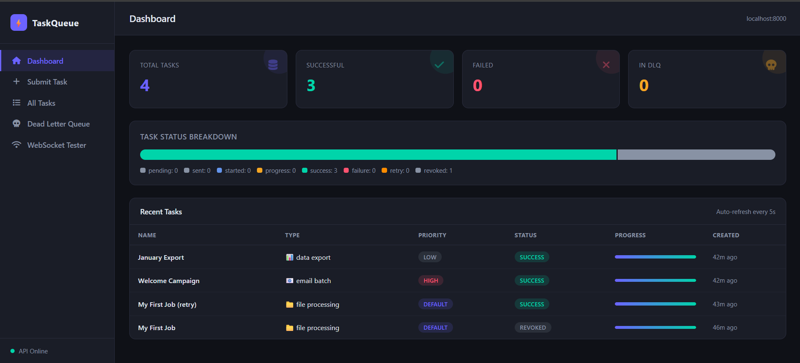
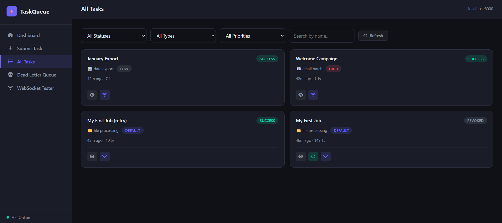
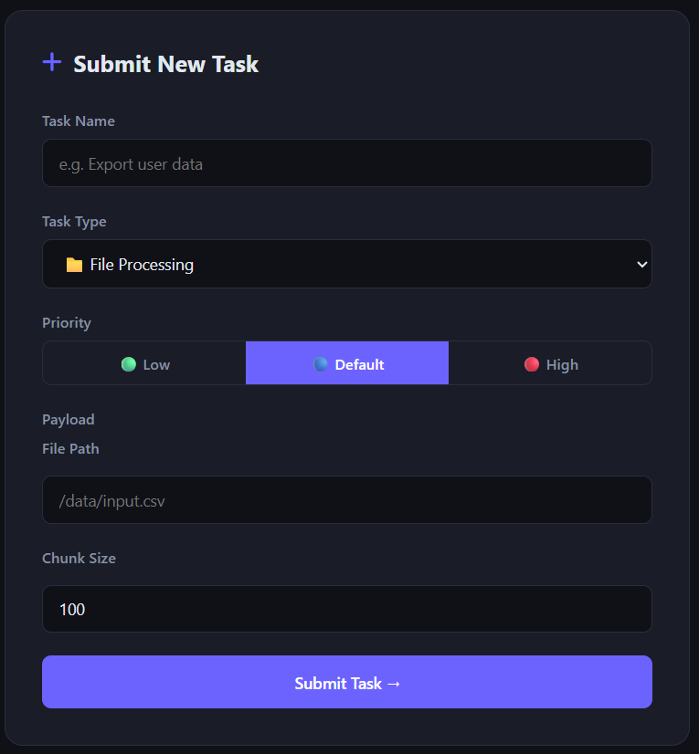

# Django Celery Task Queue

> A production-ready distributed task queue system with real-time WebSocket progress, priority queues, dead-letter queue handling, and a full monitoring stack.

---

## Architecture



---

## Screenshots


*Dashboard — live stats, status breakdown, and recent tasks*


*All Tasks — filterable card grid with retry/cancel actions*


*Submit Task — dynamic payload fields and priority selector*


---

## Features

- ✅ **3 job types** — file processing, data export, email batch
- ✅ **Priority queues** — `high` / `default` / `low` with kombu routing
- ✅ **Real-time WebSocket progress** — per-task Channel Layer push
- ✅ **Dead Letter Queue (DLQ)** — exhausted tasks captured in Redis, requeue via API
- ✅ **Auto-retry with exponential backoff** — configurable per task type
- ✅ **Django REST Framework API** — submit, cancel, retry, stats
- ✅ **Celery Beat** — periodic task scheduling
- ✅ **Flower monitoring** — live worker and queue inspection at `:5555`
- ✅ **Django Admin** — bulk retry / revoke actions
- ✅ **Full test suite** — API, unit, and WebSocket tests (pytest + pytest-asyncio)

---

## Tech Stack

| Layer | Technology |
|-------|-----------|
| Backend | Python 3.12, Django 5.x, Django REST Framework |
| WebSockets | Django Channels 4.x, Daphne (ASGI) |
| Task Queue | Celery 5.x |
| Broker / Cache | Redis 7 |
| Database | PostgreSQL 16 |
| Monitoring | Flower |
| Testing | pytest, pytest-django, pytest-asyncio, factory-boy |
| Infrastructure | Docker, Docker Compose |

---

## Prerequisites

- [Docker](https://www.docker.com/) 24+
- Docker Compose v2+

---

## Quick Start

```bash
# 1. Clone
git clone https://github.com/ATOUIYakoub/django-celery-task-queue.git
cd django-celery-task-queue

# 2. Configure environment
cp .env.example .env
# Edit .env — set a strong SECRET_KEY

# 3. Start all services
docker compose up --build -d

# 4. Run migrations
docker compose exec web python manage.py migrate

# 5. Create a superuser (for /admin)
docker compose exec web python manage.py createsuperuser
```

| Service | URL |
|---------|-----|
| REST API | http://localhost:8000/api/tasks/ |
| Django Admin | http://localhost:8000/admin/ |
| Flower Dashboard | http://localhost:5555 |
| WebSocket | `ws://localhost:8000/ws/tasks/{id}/` |

---

## API Endpoints

### Tasks

| Method | Path | Description |
|--------|------|-------------|
| `GET` | `/api/tasks/` | List all tasks — supports `?status=`, `?task_type=`, `?priority=` |
| `GET` | `/api/tasks/{id}/` | Retrieve a single task |
| `POST` | `/api/tasks/submit/` | Submit a new task |
| `POST` | `/api/tasks/{id}/cancel/` | Revoke a running task |
| `POST` | `/api/tasks/{id}/retry/` | Re-submit a failed or revoked task |
| `GET` | `/api/tasks/stats/` | Aggregate stats (counts, avg duration, DLQ depth) |

### Dashboard

| Method | Path | Description |
|--------|------|-------------|
| `GET` | `/api/dashboard/dlq/` | List all tasks in the Dead Letter Queue |
| `POST` | `/api/dashboard/dlq/{id}/requeue/` | Move a DLQ task back to its normal queue |
| `GET` | `/api/dashboard/stats/` | Redis info, worker count, per-queue depths |

### Submit Request Body

```json
{
  "name": "Weekly Export",
  "task_type": "data_export",
  "priority": 1,
  "payload": {
    "format": "csv",
    "month": "2024-01"
  }
}
```

Valid `task_type` values: `file_processing`, `data_export`, `email_batch`  
Valid `priority` values: `1` (low), `5` (default), `10` (high)

**Response (201)**
```json
{
  "id": "3fa85f64-5717-4562-b3fc-2c963f66afa6",
  "status": "sent",
  "celery_task_id": "e1b4c2d0-...",
  "ws_url": "ws://localhost:8000/ws/tasks/3fa85f64-.../"
}
```

---

## WebSocket Protocol

Connect to: `ws://localhost:8000/ws/tasks/{task_id}/`

### Server → Client

| `type` | Fields | When |
|--------|--------|------|
| `task.state` | `task_id`, `status`, `progress`, `message`, `name`, `task_type` | On connect |
| `task.progress` | `task_id`, `status`, `progress`, `message` | Each progress update |
| `task.update` | `task_id`, `status`, `progress`, `message` | On cancel / revoke |
| `pong` | — | Response to ping |

### Client → Server

| `type` | Action |
|--------|--------|
| `ping` | Server replies `{"type":"pong"}` |
| `cancel` | Revokes task, broadcasts `task.update` |

```javascript
const ws = new WebSocket("ws://localhost:8000/ws/tasks/<id>/");
ws.onmessage = ({ data }) => console.log(JSON.parse(data));
ws.send(JSON.stringify({ type: "ping" }));
```

---

## Queue Configuration

| Queue | Priority | Task Types |
|-------|----------|-----------|
| `high` | 10 | `email_batch` |
| `default` | 5 | `file_processing` |
| `low` | 1 | `data_export` |
| `dlq` | 0 | Any exhausted task |

---

## Retry & DLQ

| Task | Retries | Backoff |
|------|---------|---------|
| `process_file_task` | 3 | Exponential + jitter (max 60s) |
| `export_data_task` | 5 | Exponential (on `ConnectionError` only) |
| `send_email_batch_task` | 2 | Exponential |

When a task exhausts all retries, the `task_failure` signal pushes it to the `dlq:tasks` Redis list. Use `POST /api/dashboard/dlq/{id}/requeue/` to re-submit it.

---

## Running Tests

```bash
# Full suite
docker compose exec web pytest tests/ -v

# With coverage
docker compose exec web pytest tests/ --cov=apps --cov-report=term-missing
```

---

## Environment Variables

| Variable | Default | Description |
|----------|---------|-------------|
| `DEBUG` | `True` | Django debug mode |
| `SECRET_KEY` | — | **Required.** Django secret key |
| `DATABASE_URL` | `postgres://postgres:postgres@db:5432/taskqueue` | PostgreSQL DSN |
| `REDIS_URL` | `redis://redis:6379/0` | Channel Layer (db 0) |
| `CELERY_BROKER_URL` | `redis://redis:6379/1` | Celery broker (db 1) |
| `CELERY_RESULT_BACKEND` | `redis://redis:6379/2` | Result backend (db 2) |
| `ALLOWED_HOSTS` | `localhost,127.0.0.1` | Comma-separated allowed hosts |
| `CORS_ALLOWED_ORIGINS` | `http://localhost:3000` | CORS whitelist |

---

## Production Checklist

- [ ] Set `DEBUG=False`, use `config.settings.production`
- [ ] Generate a strong `SECRET_KEY`
- [ ] Use managed PostgreSQL and Redis
- [ ] Configure `ALLOWED_HOSTS` and `CORS_ALLOWED_ORIGINS`
- [ ] Run `python manage.py collectstatic` + serve via CDN / whitenoise
- [ ] Enable SSL — `SECURE_SSL_REDIRECT=True` is already on in production settings
- [ ] Add rate limiting / authentication to API endpoints
- [ ] Enable Flower auth: `--basic-auth=user:password`
- [ ] Set up log aggregation (Sentry, Datadog, etc.)
- [ ] Alert on `dlq:tasks` Redis list length

---

## Project Structure

```
taskqueue/
├── docker-compose.yml
├── Dockerfile
├── .env.example
├── requirements.txt
├── pytest.ini
├── manage.py
├── config/
│   ├── settings/base.py · development.py · production.py
│   ├── asgi.py          ← Channels entry point
│   └── celery.py        ← Celery app + DLQ signal
├── apps/
│   ├── tasks/
│   │   ├── models.py    ← TaskRecord (UUID PK, 8 statuses, 4 indexes)
│   │   ├── tasks.py     ← 3 Celery tasks + base class + DLQ utils
│   │   ├── consumers.py ← AsyncJsonWebsocketConsumer
│   │   ├── views.py     ← Submit, Cancel, Retry, Stats
│   │   └── admin.py     ← Bulk retry / revoke
│   └── dashboard/
│       └── views.py     ← DLQ list/requeue, system stats
└── tests/
    ├── conftest.py · test_api.py · test_tasks.py · test_websocket.py
```

---

## License

MIT
